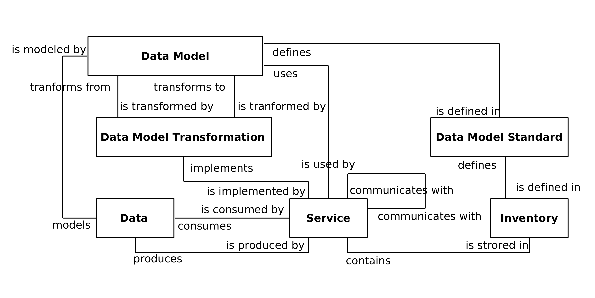
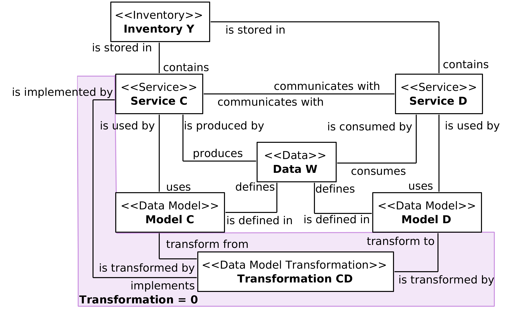
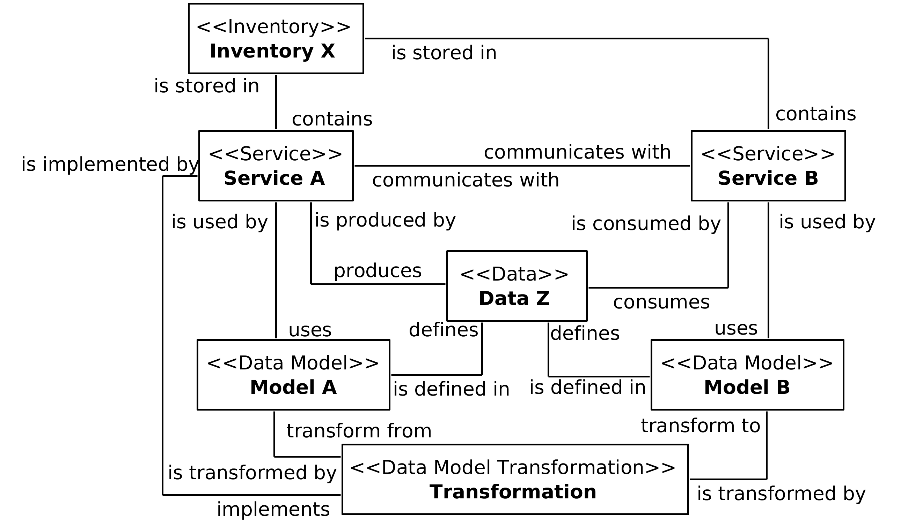
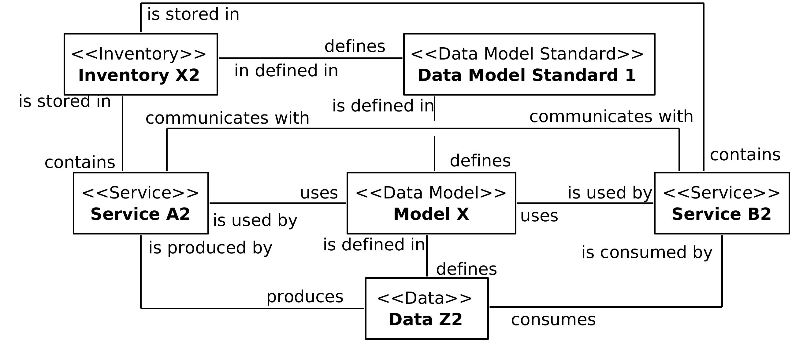
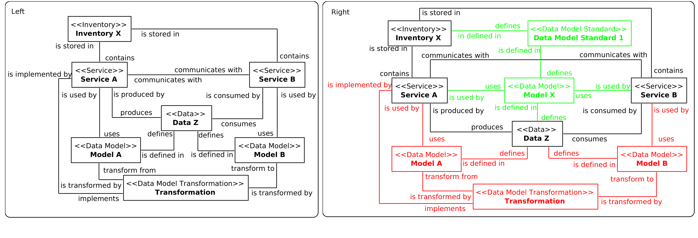
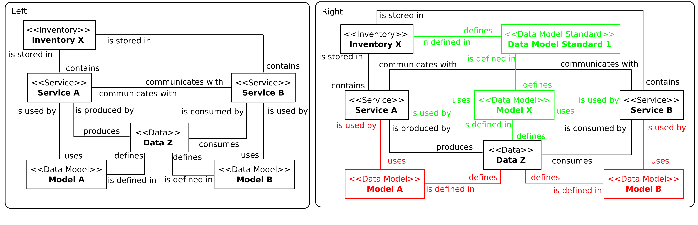

#  Summary

How can services be designed to avoid data model transformation?

##  Problem
Services with disparate models for similar data impose transformation requirements that increase development effort, design complexity, and runtime performance overhead.

##  Solution
Data models for common information sets are standardized across service contracts within an inventory boundary.

##  Application
Design standards are applied to schemas used by service contracts as part of a formal design process.

##  Impacts
Maintaining the standardization of contract schemas can introduce significant governance effort and cultural challenges.

##  Principles
Standardized Service Contract

##  Architecture
Inventory, Service

#  (Semi)Formalized Profile
##  Vocabulary

##  Problem Variants
###  Model transformation is required

###  Model transformation is implemented

##  Solution Variants
###  Standardized model for data is defined

##  Application
###  Tranformation implmenentation is removed

###  Standardized model is defined

**[Back](./)**

